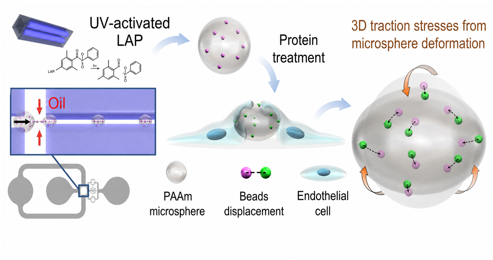
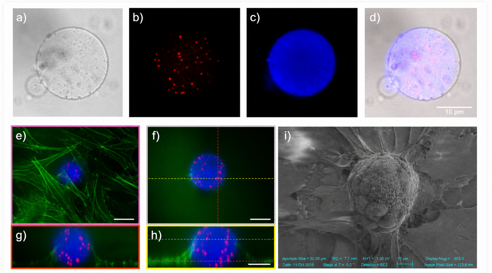

My first senior author paper is finally out! 🔊🥳🙌

It’s incredibly rewarding to see this one published after a journey stretching from late PhD brainstorming, initial experiments and proof of concept to completion. Our goal was simple but ambitious: measure three-dimensional cellular forces without needing niche fabrication tools or complex analysis pipelines. We wanted a practical method for anyone to probe cell mechanics in real, physiological environments.

So, we developed a high-throughput workflow using microfluidics and standard lab equipment to create polyacrylamide microbeads with precisely tunable size and elasticity. By leveraging photoinitiators with superior partition coefficients and high UV absorption, we achieved reliable polymerization and functionalization at scale—no specialized gear required. These beads can also be embedded with fluorescent nanobeads for direct 3D force readout through point set registration.

As a proof of concept, we measured how a monolayer of vascular endothelial cells interacts with these microsphere probes, tracking fluorescent nanobead motion to reveal the actual traction forces exerted in three dimensions. The results? The cell monolayer applies strong radial compression to encapsulated probes, hinting at new biomechanical functions in vascular biology and cell migration—potentially impacting how we understand diapedesis and pathogen uptake.

In a nutshell:

- Developed an accessible, scalable technique for fabricating cellular force probes
- Enabled direct quantification of mechanical forces in physiological settings in 3D
- Discovered new collective behaviors in vascular endothelial cells

Huge thanks to my collaborators and mentors who helped bring this vision to reality!

📄 Read the full paper here: https://doi.org/10.1016/j.actbio.2025.08.041
