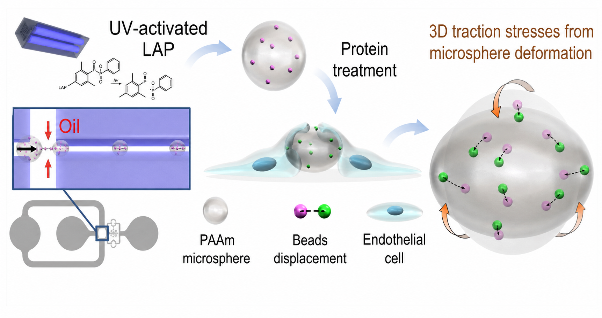
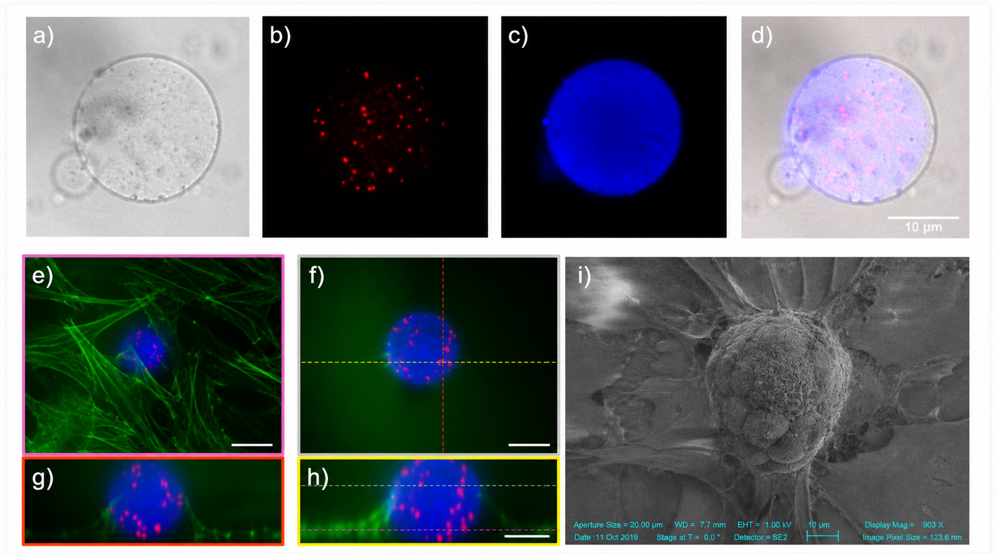

My first senior author paper is finally out! 🔊🥳🙌

It’s incredibly rewarding to see this one published after a journey stretching from late PhD brainstorming, initial experiments and proof of concept to completion. Our goal was simple but ambitious: measure three-dimensional cellular forces without needing niche fabrication tools or complex analysis pipelines. We wanted a practical method for anyone to probe cell mechanics in real, physiological environments.

## An accessible force probe

We developed a high-throughput workflow using microfluidics and standard lab equipment to create polyacrylamide microspheres with precisely tunable size and elasticity. By leveraging photoinitiators with favorable partition coefficients and high ultraviolet absorption, we achieved reliable polymerization and functionalization at scale without specialized fabrication equipment.

The microspheres can be functionalized with extracellular-matrix proteins and embedded with fluorescent nanobeads. This combination allows cells to interact with the probe while the internal markers provide a direct record of how the sphere deforms.

## Measuring forces in three dimensions

To recover the forces, we compared the fluorescent marker positions before and after deformation using point-set registration. The resulting displacement field was then used to infer the three-dimensional traction stresses acting across the microsphere surface.

As a proof of concept, we measured how a monolayer of vascular endothelial cells interacted with the probes. Tracking the fluorescent nanobead motion revealed that the cell monolayer applied strong radial compression to encapsulated microspheres.

## What we learned

This collective compression suggests that endothelial monolayers can mechanically engage three-dimensional objects in ways that are not apparent from conventional two-dimensional traction measurements. The result opens interesting questions about the biomechanics of vascular barriers, cell migration, diapedesis, and the uptake of pathogens or other particles.

In a nutshell, the work:

- Developed an accessible, scalable technique for fabricating cellular force probes
- Enabled direct quantification of mechanical forces in physiological settings in 3D
- Discovered new collective behaviors in vascular endothelial cells

Huge thanks to my collaborators and mentors who helped bring this vision to reality!

📄 Read the full paper: [A. Garcia-Herreros *et al.*, *Acta Biomaterialia* **205**, 521–536 (2025)](https://doi.org/10.1016/j.actbio.2025.08.041).
