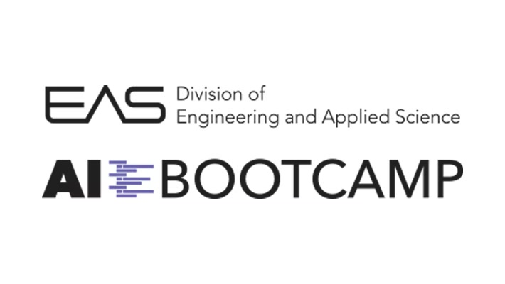
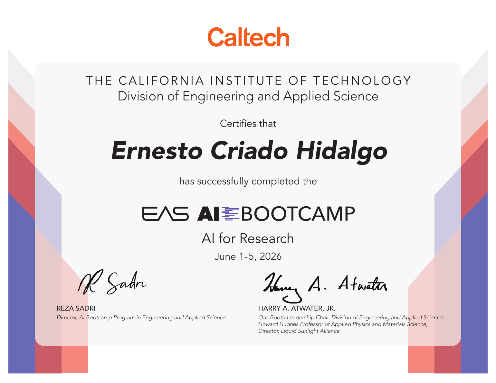

Last month I completed Caltech's EAS AI Bootcamp: AI for Research, an intensive five-day course on how modern AI tools can be incorporated into scientific workflows. The program moved quickly from the foundations of large language models to hands-on systems for retrieval, tool use, foundation models, and autonomous discovery.

What I enjoyed most was the emphasis on moving beyond chat. The goal was not simply to ask a model isolated questions, but to understand how to build structured, reproducible pipelines that can work across scientific literature, experimental data, and multi-step research problems.

## From prompts to reproducible research workflows

The first part of the course focused on the anatomy of an API call and the practical details that turn a useful model interaction into a repeatable research tool: model selection, message structure, structured outputs, JSON schemas, Pydantic validation, batch processing, and multi-step reasoning.

That distinction matters. A conversation with one paper in context can be helpful, but a research workflow often needs to process hundreds of papers or samples in a consistent way, preserve intermediate results, and make every step inspectable.

## Connecting models to scientific knowledge

We then moved into retrieval-augmented generation (RAG), advanced retrieval, and knowledge graphs. The sessions explored how to connect models to private or specialized data sources, when retrieval is preferable to simply adding more context, and how problems such as poor chunking, missing information, or retrieval poisoning can undermine an otherwise convincing answer.

This part connected especially well with the [LLM knowledge base for research](/blog/llm-knowledge-base-for-research/) that I built earlier. The bootcamp gave me a much clearer framework for thinking about retrieval quality, grounding, and the tradeoffs between long-context models, vector search, and graph-based approaches.

## Agents, tools, and scientific loops

The middle of the week shifted from single model calls to agents and tool use. We worked through the building blocks of tool calling, the Model Context Protocol, and research loops in which a model can retrieve information, call specialized software, evaluate an intermediate result, and decide what to do next.

The most useful lesson here was that autonomy is not the same as reliability. Good agentic workflows still need constrained tools, explicit state, clear stopping conditions, and checks that keep plausible-looking errors from propagating through the pipeline.

## Foundation models and autonomous discovery

The final sessions looked at where foundation models can replace, augment, or sit alongside hand-engineered features in scientific workflows. Examples ranged from visual and neural representations to symbolic regression, protein design, and inverse problems in the physical sciences.

We finished by considering autonomous discovery systems: AI co-scientists, automated laboratories, simulated discovery loops, and the opportunities and limitations of increasingly capable research agents. It was exciting to see how quickly these systems are evolving, but equally valuable to discuss where domain expertise, careful validation, and scientific judgment remain essential.

## A few takeaways

- Structured outputs and reproducible batch processing are what turn an impressive demo into a useful research tool.
- RAG, long context, and knowledge graphs solve different problems; choosing among them should follow the structure of the data and the question.
- Tool-using agents become more useful when their actions and intermediate results remain visible and testable.
- Foundation models are often most powerful as components within a scientific loop rather than replacements for the entire workflow.
- AI can accelerate research, but it does not remove the need for clean data, appropriate baselines, and critical evaluation.

Many thanks to Reza Sadri and the teaching team for putting together such a thoughtful and practical week. The [Caltech EAS AI Bootcamp](https://aibootcamp.caltech.edu/news/reza-sadri-ai-bootcamp) was a great opportunity to connect ideas I had already been exploring with a broader view of how AI can support scientific discovery.
