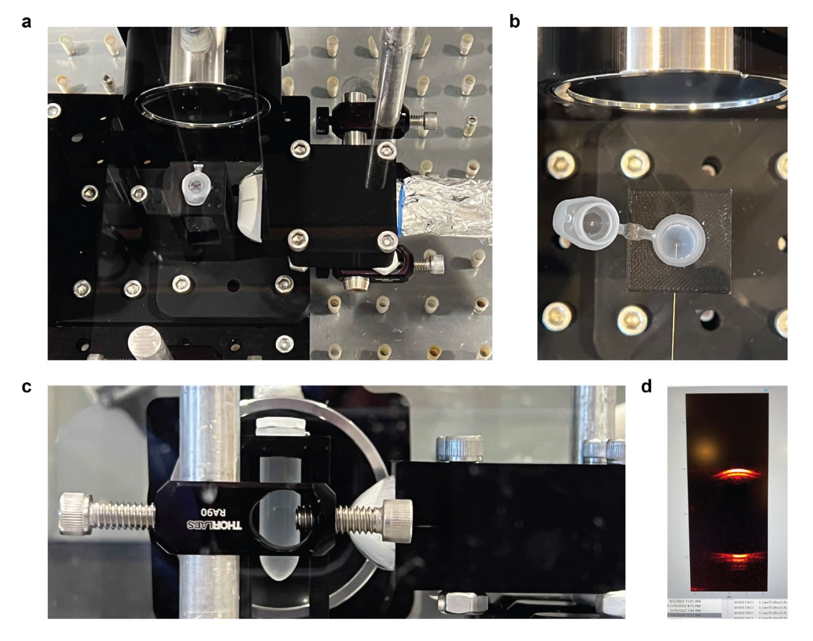
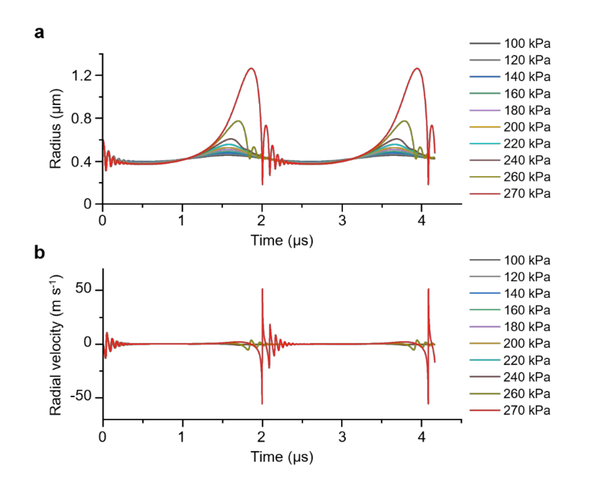
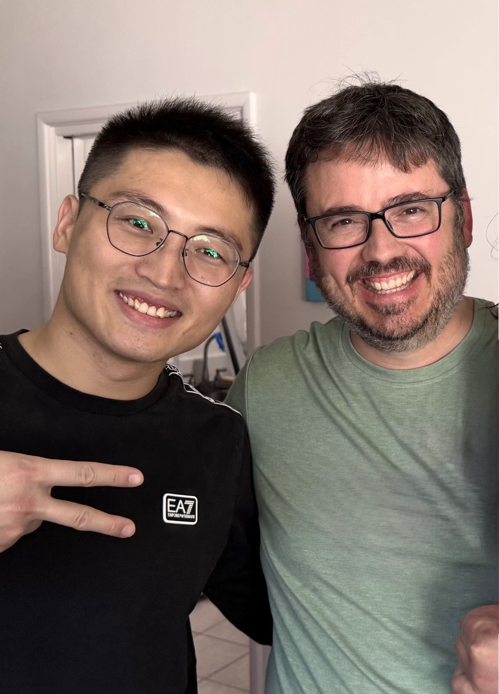

Glad to see this one out! Really fun working with Songsong Tang characterizing the acoustic response of CBRs! A really exciting US-activated therapy with great potential for clinical translation!

In this work from Prof. Wei Gao's lab, two complementary robot types were introduced: magnetically controlled microbubble robots (MBRs) that combine enzyme-powered propulsion with real-time ultrasound imaging and magnetically guided navigation in deep tissue, and chemotactic microbubble robots (CBRs) that sense endogenous hydrogen peroxide gradients and autonomously migrate toward tumour microenvironments without external field guidance.

My contribution consisted on setting up a PCD rig that demonstrated that the gas trapped inside CBRs is able to inertially cavitate for several seconds, hence helping drug penetration in vivo. We also simulated the required threshold for these bubbles to undergo inertial cavitation using a simple Keller-Miksis model.

Working with Songsong was a real pleasure and helped forge a great friendship!

Read the paper [here](https://www.nature.com/articles/s41565-025-02109-6) and [Caltech's comment](https://www.caltech.edu/about/news/bubble-bots-simple-biocompatible-microrobots-autonomously-target-tumors) for a great overview of the work.

