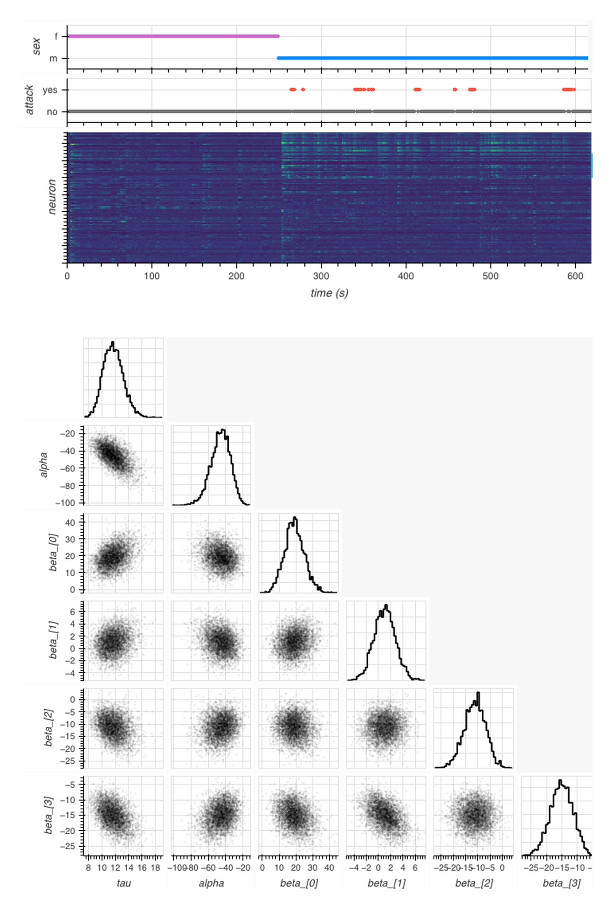

I spent the last part of June at the 2025 Data Science and AI for Neuroscience Summer School at Caltech. It was an immersive two-week program for people in neuroscience who want to get more comfortable with the computational side of the field, and it struck a really nice balance between practical workflows and the theory behind them.

## What made it useful

The curriculum built up in a very intentional way. We started with Python-based data wrangling and visualization, then moved into neuroscience data formats and organization, and eventually into probability, sampling, Bayesian inference, MCMC, model assessment, and optimization. The technical sessions also touched on split-apply-combine workflows, file formats such as MAT, TDT, HDF5, and NWB, and the kinds of tools that make large neuroscience datasets much easier to work with.

## A few themes that stuck with me

- keeping data structures clean enough that analysis stays reproducible
- using visualization to catch issues before they turn into modeling mistakes
- thinking about model selection and posterior checks as part of the workflow
- using hierarchical models, PCA, HMMs, and GLMs when the question calls for them
- treating inference as a pipeline rather than a one-off calculation

One especially helpful companion resource was [Distribution Explorer](https://distribution-explorer.github.io/), which is a great way to build intuition about probability distributions, sampling behavior, and how assumptions shape model geometry.

## Why it mattered

What I appreciated most was that the school never treated data science as an abstract add-on. The emphasis stayed on real neuroscience use cases, where the goal is to move from noisy measurements to interpretable results without losing the structure of the problem along the way. The shared pace also made it easy to talk through ideas with other participants and instructors, which was just as valuable as the technical content itself.

The official summer school page is [here](https://neuroscience.caltech.edu/programs/datasai-for-neuroscience-summer-schools/2025-data-science-and-ai-for-neuroscience-summer-school), and the technical course materials are [here](https://caltech-datasai.github.io/).

I left with a stronger appreciation for how much more expressive neuroscience analysis becomes when data handling, visualization, and statistical modeling are treated as one continuous workflow.
