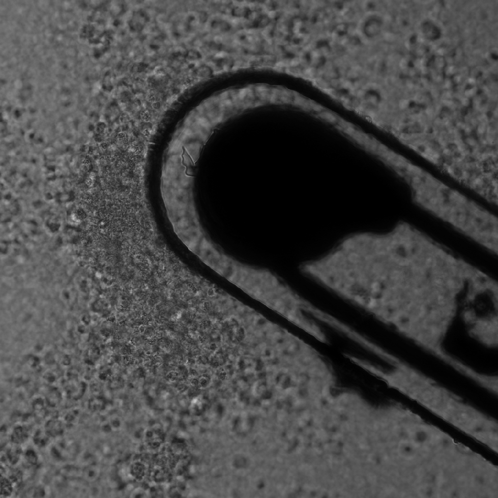

This was such a fun and exciting collaboration! 🧠🔊 Working closely with super talented 1st authors Jason Hou & Md Osman Goni Nayeem and with Sarah Ornellas from [Conformable Decoders (Prof. Canan Dagdeviren)](https://conformabledecoders.media.mit.edu/) at [MIT's Media Lab](https://www.media.mit.edu/) on the acoustic characterization & in vitro biocompatibility of ImPULS was 🔥🔥🔥

ImPULS is an implantable piezoelectric ultrasound stimulator generating ultrasonic focal pressures of up to 100 kPa to modulate the activity of neurons in the deep brain! The device is about the thickness of a human hair with no electrochemically active elements!

Want to learn more about this technology and potential applications? Make sure to check out [this press release](https://t.co/oG4DdNNiCz), [this one too](https://t.co/CyHiYYExFS), or [this great summary](https://x.com/medialab/status/1813632855303438400) of the motivations, design process and applications of this cool development.
