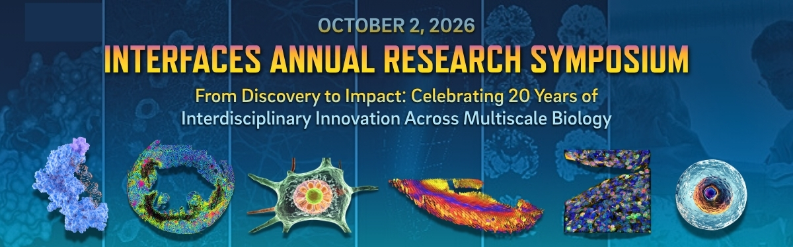
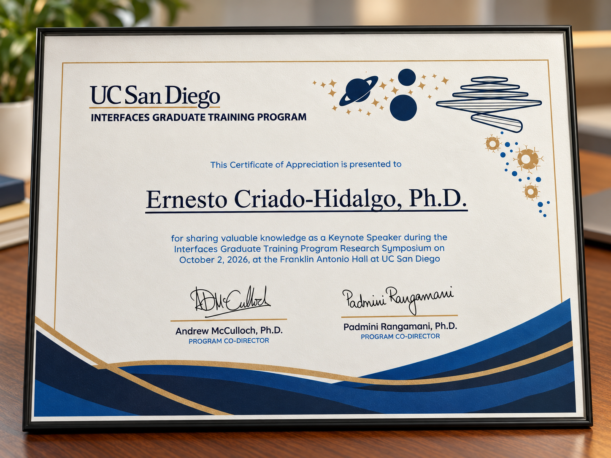

On October 2, I returned to UC San Diego for the Interfaces Annual Research Symposium and 20th Anniversary Celebration, where I was invited to give a plenary talk and participate in the career panel. It was a pleasure to mark this milestone as an Interfaces alumnus and contribute to a program that connects engineering, physical sciences, biology, and medicine.

My talk, **“Engineering the Physical Interface with Biology: Mechanics, Ultrasound, and Cellular Control,”** brought together the research areas that have shaped my path: mechanobiology and biological fluid mechanics at UC San Diego, followed by biomolecular ultrasound and sonogenetics at Caltech. Across these areas, the connecting question is how physical tools and quantitative engineering can help us understand and control biological systems.

Returning to UC San Diego also gave me a chance to remember my PhD co-advisor, Juan Lasheras, with deep affection and gratitude. Juan had a profound influence on my life and career, shaping how I think as an engineer and inspiring my path at the intersection of engineering and medicine. I miss him dearly, and it meant a great deal to honor his memory in the place where I had the privilege of learning from him.

Held at Franklin Antonio Hall, the symposium brought alumni talks together with trainee lightning talks, posters, and a career panel. Joining the panel was another opportunity to contribute to the celebration, alongside the scientific program.

My sincere thanks to **Padmini Rangamani and Andy McCulloch** for the invitation and for bringing this community together. I was delighted to take part as both a speaker and a panelist, and to celebrate twenty years of Interfaces with them, fellow alumni, and current trainees.

The full schedule and speaker biographies are available in the [official symposium program](https://interfaces.ucsd.edu/events/2026/interfaces-research-symposium-20th-anniversary-celebration).
